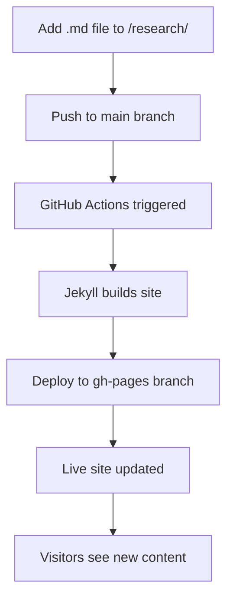

# Research Webpage Product Requirements Document

## 1. Product Overview
A professional academic research webpage hosted on GitHub Pages that automatically processes and displays research papers from markdown files. The site serves as a personal academic portfolio with automated content management through GitHub Actions workflows.

- Solves the problem of maintaining an up-to-date research portfolio without manual webpage updates
- Target users: Academic researchers, PhD students, and professionals showcasing their work
- Provides automated publishing pipeline from markdown research papers to professional web presentation

## 2. Core Features

### 2.1 User Roles
| Role | Registration Method | Core Permissions |
|------|---------------------|------------------|
| Site Owner | GitHub repository owner | Full access to content management, workflow configuration |
| Visitors | Public access | Can browse research papers, publications, and academic profile |

### 2.2 Feature Module
Our research webpage consists of the following main pages:
1. **Home page**: hero section with researcher profile, featured publications, navigation menu
2. **Publications page**: automatically generated list of research papers from markdown files, filtering and search
3. **Research page**: detailed view of individual papers with metadata, abstracts, and download links
4. **About page**: academic biography, education, experience, and contact information

### 2.3 Page Details
| Page Name | Module Name | Feature description |
|-----------|-------------|---------------------|
| Home page | Hero section | Display researcher name, title, institution, profile photo with animated background |
| Home page | Featured publications | Show 3-5 most recent or important papers with thumbnails and brief descriptions |
| Home page | Navigation menu | Responsive navigation with smooth scrolling and mobile hamburger menu |
| Publications page | Paper list | Auto-generate publication list from markdown files with sorting by date, type, or relevance |
| Publications page | Search and filter | Real-time search functionality and category filters (conference, journal, preprint) |
| Publications page | Metadata display | Show publication year, venue, authors, and citation count if available |
| Research page | Paper details | Full paper information including abstract, methodology, results, and conclusions |
| Research page | Download links | Provide PDF download, BibTeX citation, and external links to publisher |
| Research page | Related work | Suggest related papers from the same author or similar topics |
| About page | Academic profile | Education timeline, research interests, and professional experience |
| About page | Contact form | Contact information and optional contact form integration |

## 3. Core Process
**Content Management Flow:**
1. Researcher adds new markdown file to `/research/` folder in main branch
2. GitHub Actions workflow automatically triggers on push to main branch
3. Jekyll processes markdown files and generates static HTML pages
4. Compiled site is deployed to gh-pages branch and published via GitHub Pages
5. Visitors can immediately access the updated content on the live website

**Publication Workflow:**

## 4. User Interface Design
### 4.1 Design Style
- **Primary colors**: Deep blue (#1e3a8a) and white (#ffffff) for professional academic look
- **Secondary colors**: Light gray (#f8fafc) for backgrounds, accent blue (#3b82f6) for links
- **Button style**: Rounded corners (8px radius) with subtle shadows and hover animations
- **Typography**: Inter font family, 16px base size, with clear hierarchy (h1: 2.5rem, h2: 2rem, h3: 1.5rem)
- **Layout style**: Clean grid-based layout with card components, sticky navigation, and generous whitespace
- **Icons**: Feather icons for consistency, academic icons (graduation cap, book, document) for context

### 4.2 Page Design Overview
| Page Name | Module Name | UI Elements |
|-----------|-------------|-------------|
| Home page | Hero section | Full-width background with gradient overlay, centered content, profile image with border radius, animated typing effect for title |
| Home page | Featured publications | Card-based layout with hover effects, thumbnail images, publication badges, and call-to-action buttons |
| Publications page | Paper list | Table/card hybrid view with sortable columns, publication type badges, and quick preview on hover |
| Publications page | Search and filter | Sticky search bar with real-time results, dropdown filters with checkboxes, and result count display |
| Research page | Paper details | Two-column layout with paper metadata sidebar, main content area with typography hierarchy |
| About page | Academic profile | Timeline component with education milestones, skill tags, and social media links |

### 4.3 Responsiveness
Desktop-first responsive design with mobile optimization. Touch-friendly navigation with swipe gestures for mobile paper browsing. Breakpoints at 768px (tablet) and 480px (mobile) with fluid typography scaling.
