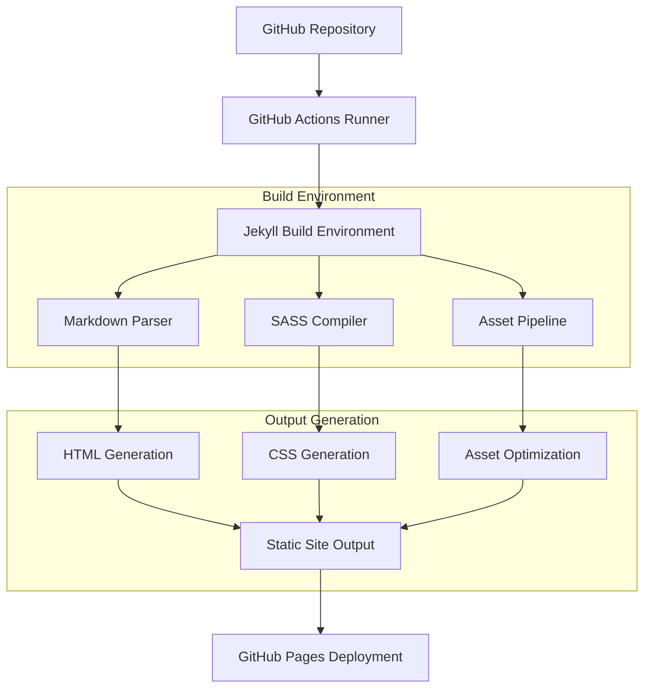
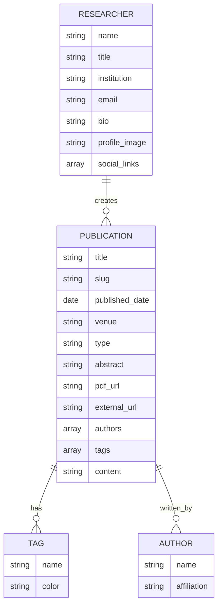

# Research Webpage Technical Architecture Document

## 1. Architecture Design

```mermaid
graph TD
    A[User Browser] --> B[GitHub Pages]
    C[Researcher] --> D[GitHub Repository - Main Branch]
    D --> E[GitHub Actions Workflow]
    E --> F[Jekyll Build Process]
    F --> G[GitHub Pages - gh-pages Branch]
    G --> B
    
    subgraph "Content Management"
        D
        H[/research/*.md files]
        I[/_config.yml]
        J[/assets/ - CSS, JS, Images]
    end
    
    subgraph "Build Pipeline"
        E
        F
        K[Markdown Processing]
        L[SASS Compilation]
        M[Asset Optimization]
    end
    
    subgraph "Hosting Layer"
        B
        G
    end
```

## 2. Technology Description

* Frontend: Jekyll\@4.3 + Liquid templating + SASS + Vanilla JavaScript

* Build System: GitHub Actions with Ruby 3.0

* Hosting: GitHub Pages (Static Site Hosting)

* Content Management: Git-based workflow with Markdown files

## 3. Route Definitions

| Route           | Purpose                                                               |
| --------------- | --------------------------------------------------------------------- |
| /               | Home page with researcher profile and featured publications           |
| /publications   | Complete list of research papers with search and filtering            |
| /research/:slug | Individual research paper detail pages (auto-generated from markdown) |
| /about          | Academic biography and contact information                            |
| /assets/\*      | Static assets (CSS, JavaScript, images, PDFs)                         |

## 4. API Definitions

### 4.1 Core API

**GitHub Actions Workflow API**

```yaml
Workflow Trigger: push to main branch
```

Input:

| Param Name      | Param Type | isRequired | Description                               |
| --------------- | ---------- | ---------- | ----------------------------------------- |
| markdown\_files | array      | true       | List of .md files in /research/ directory |
| site\_config    | object     | true       | Jekyll configuration from \_config.yml    |
| assets          | array      | false      | Static assets to be processed             |

Output:

| Param Name    | Param Type | Description                       |
| ------------- | ---------- | --------------------------------- |
| build\_status | boolean    | Success/failure of Jekyll build   |
| deploy\_url   | string     | URL of deployed GitHub Pages site |
| build\_time   | number     | Build duration in seconds         |

**Jekyll Liquid Data API**

```liquid
Access research papers: {{ site.research }}
```

Example markdown frontmatter:

```yaml
---
title: "Deep Learning for Natural Language Processing"
authors: ["John Doe", "Jane Smith"]
date: 2024-01-15
venue: "ICML 2024"
type: "conference"
tags: ["deep-learning", "nlp", "transformers"]
abstract: "This paper presents a novel approach..."
pdf_url: "/assets/papers/deep-learning-nlp-2024.pdf"
---
```

## 5. Server Architecture Diagram



## 6. Data Model

### 6.1 Data Model Definition



### 6.2 Data Definition Language

**Jekyll Configuration (\_config.yml)**

```yaml
# Site settings
title: "Dr. John Doe - Research Portfolio"
description: "Academic research in machine learning and natural language processing"
url: "https://username.github.io"
baseurl: ""

# Researcher information
researcher:
  name: "Dr. John Doe"
  title: "Assistant Professor"
  institution: "University of Technology"
  email: "john.doe@university.edu"
  bio: "Researcher specializing in deep learning and NLP"
  profile_image: "/assets/images/profile.jpg"
  social_links:
    - name: "Google Scholar"
      url: "https://scholar.google.com/citations?user=example"
    - name: "GitHub"
      url: "https://github.com/username"
    - name: "LinkedIn"
      url: "https://linkedin.com/in/username"

# Collections
collections:
  research:
    output: true
    permalink: /research/:slug/

# Build settings
markdown: kramdown
highlighter: rouge
sass:
  style: compressed

# Plugins
plugins:
  - jekyll-feed
  - jekyll-sitemap
  - jekyll-seo-tag
```

**GitHub Actions Workflow (.github/workflows/deploy.yml)**

```yaml
name: Deploy Jekyll site to Pages

on:
  push:
    branches: ["main"]
  workflow_dispatch:

permissions:
  contents: read
  pages: write
  id-token: write

concurrency:
  group: "pages"
  cancel-in-progress: false

jobs:
  build:
    runs-on: ubuntu-latest
    steps:
      - name: Checkout
        uses: actions/checkout@v4
      - name: Setup Ruby
        uses: ruby/setup-ruby@v1
        with:
          ruby-version: '3.1'
          bundler-cache: true
      - name: Setup Pages
        id: pages
        uses: actions/configure-pages@v4
      - name: Build with Jekyll
        run: bundle exec jekyll build --baseurl "${{ steps.pages.outputs.base_path }}"
        env:
          JEKYLL_ENV: production
      - name: Upload artifact
        uses: actions/upload-pages-artifact@v3

  deploy:
    environment:
      name: github-pages
      url: ${{ steps.deployment.outputs.page_url }}
    runs-on: ubuntu-latest
    needs: build
    steps:
      - name: Deploy to GitHub Pages
        id: deployment
        uses: actions/deploy-pages@v4
```

**Directory Structure**

```
/
├── _config.yml
├── _layouts/
│   ├── default.html
│   ├── home.html
│   ├── page.html
│   └── research.html
├── _includes/
│   ├── header.html
│   ├── footer.html
│   └── navigation.html
├── _sass/
│   ├── _base.scss
│   ├── _layout.scss
│   └── _components.scss
├── _research/
│   ├── 2024-01-15-deep-learning-nlp.md
│   └── 2023-12-10-transformer-optimization.md
├── assets/
│   ├── css/
│   ├── js/
│   ├── images/
│   └── papers/
├── pages/
│   ├── publications.md
│   └── about.md
├── index.md
├── Gemfile
└── .github/
    └── workflows/
        └── deploy.yml
```

